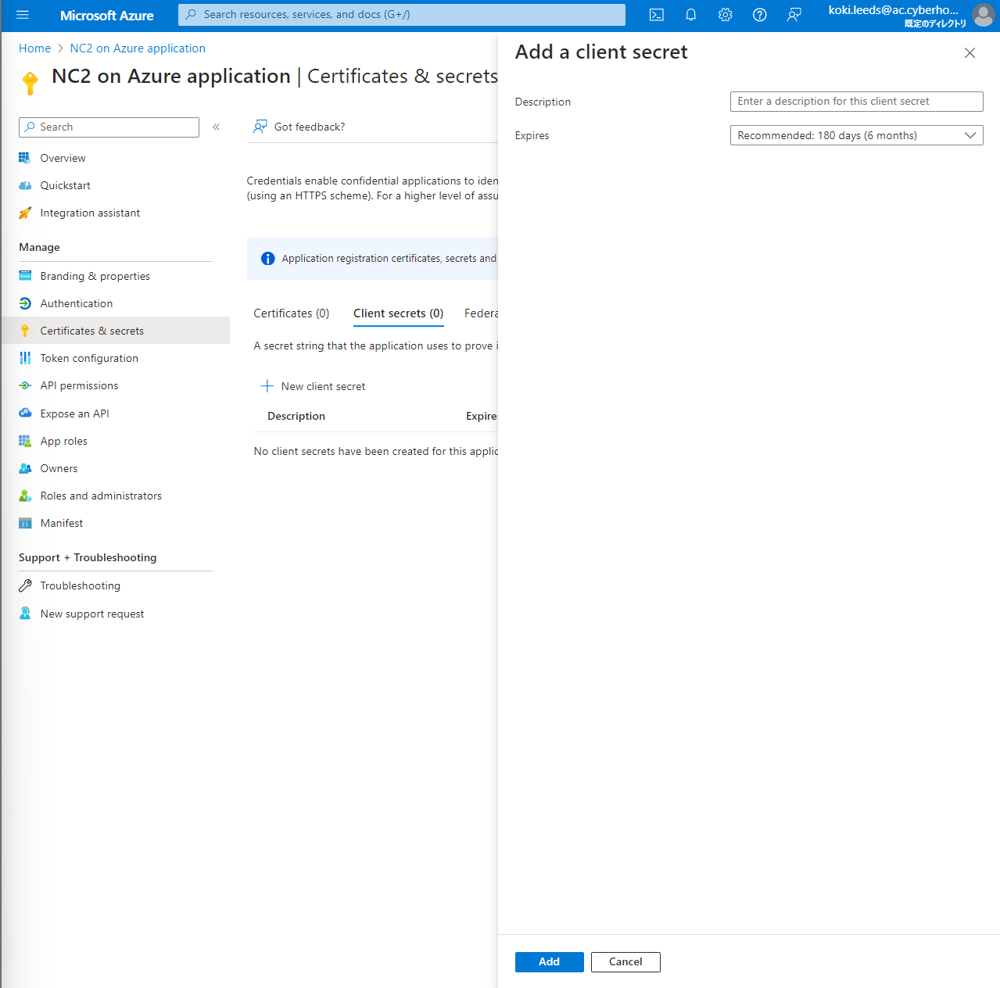
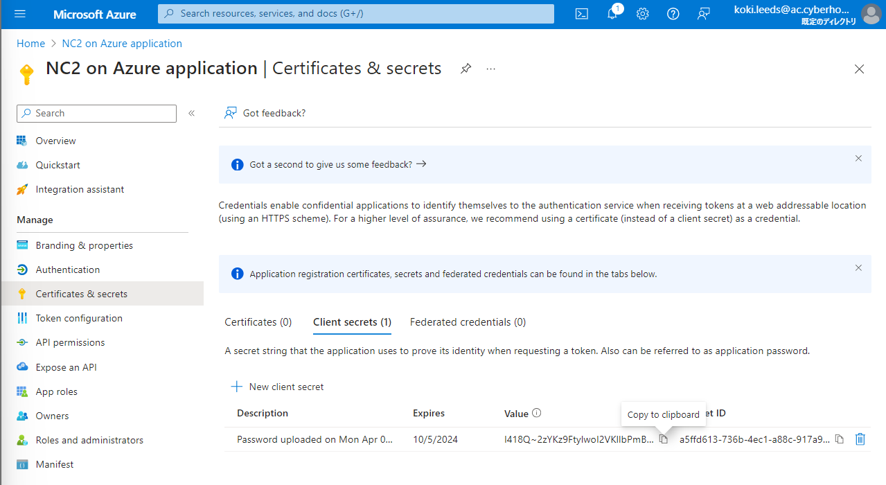

# Azure Configuration

The following lists are required to deploy and operate NC2 on Azure.
 
 - Register Azure resource providers
 - Create an App registration 

##  Registering Azure Resource Providers

Go to your **Subscription**, click **Resource providers** on the left panel, and then search for **Microsoft.Nutanix** and **Microsoft.Network**.

You can also filter by name in the textbox to find them easier.

Click Register on the top of the search bar and those status will be shown as Registered shortly.


???Info "Info - Registering the Azure Resource Providers"
        
       For those who prefer commands, refer to [Registering the Azure Resource Providers](https://portal.nutanix.com/page/documents/details?targetId=Nutanix-Cloud-Clusters-Azure:nc2-clusters-azure-registering-the-azure-resource-providers-c.html).

Now we are ready to utilize resources of **Microsoft.Nutanix** and **Microsoft.Network**.

## Creating an App Registration

In order for NC2 to provision and manage clusters in Azure, you must create an App registration with an appropriate role. Otherwise, NC2 will fail to access to resources in Azure.

Follow these steps below to create the App registration.

- Create an Azure custom role
- Register an App
- Assign the Azure custom role
- Generate a client secret

### Creating an Azure Custom Role

Go to your Subscription, navigate Access control (IAM) on the left panel and click an Add button on a Create a custom role box.


Copy JSON below:

```json
{
    "properties": {
        "roleName": "nc2-custom-role",
        "description": "",
        "assignableScopes": [
            "/subscriptions/<subscription_id>"
        ],
        "permissions": [
            {
                "actions": [
                    "Microsoft.Compute/register/action",
                    "Microsoft.Compute/availabilitySets/write",
                    "Microsoft.Compute/availabilitySets/delete",
                    "Microsoft.Compute/disks/read",
                    "Microsoft.Compute/disks/write",
                    "Microsoft.Compute/disks/delete",
                    "Microsoft.Compute/disks/beginGetAccess/action",
                    "Microsoft.Compute/disks/endGetAccess/action",
                    "Microsoft.Compute/locations/usages/read",
                    "Microsoft.Compute/availabilitySets/read",
                    "Microsoft.Compute/virtualMachines/*",
                    "Microsoft.Compute/snapshots/*",
                    "Microsoft.Compute/images/*",
                    "Microsoft.Compute/skus/read",
                    "Microsoft.Network/register/action",
                    "Microsoft.Network/loadBalancers/*",
                    "Microsoft.Network/applicationSecurityGroups/delete",
                    "Microsoft.Network/applicationSecurityGroups/joinIpConfiguration/action",
                    "Microsoft.Network/applicationSecurityGroups/joinNetworkSecurityRule/action",
                    "Microsoft.Network/applicationSecurityGroups/listIpConfigurations/action",
                    "Microsoft.Network/applicationSecurityGroups/read",
                    "Microsoft.Network/applicationSecurityGroups/write",
                    "Microsoft.Network/natGateways/*",
                    "Microsoft.Network/networkInterfaces/*",
                    "Microsoft.Network/networkSecurityGroups/*",
                    "Microsoft.Network/publicIPAddresses/*",
                    "Microsoft.Network/virtualNetworks/*",
                    "Microsoft.Network/locations/usages/read",
                    "Microsoft.Storage/register/action",
                    "Microsoft.Storage/checknameavailability/read",
                    "Microsoft.Storage/locations/checknameavailability/read",
                    "Microsoft.Storage/locations/usages/read",
                    "Microsoft.Storage/operations/read",
                    "Microsoft.Storage/skus/read",
                    "Microsoft.Storage/storageAccounts/write",
                    "Microsoft.Storage/storageAccounts/read",
                    "Microsoft.Storage/storageAccounts/delete",
                    "Microsoft.Storage/storageAccounts/blobServices/containers/clearLegalHold/action",
                    "Microsoft.Storage/storageAccounts/blobServices/containers/delete",
                    "Microsoft.Storage/storageAccounts/blobServices/containers/lease/action",
                    "Microsoft.Storage/storageAccounts/blobServices/containers/read",
                    "Microsoft.Storage/storageAccounts/blobServices/containers/write",
                    "Microsoft.Storage/storageAccounts/blobServices/read",
                    "Microsoft.Storage/storageAccounts/blobServices/write",
                    "Microsoft.Storage/storageAccounts/listAccountSas/action",
                    "Microsoft.Storage/storageAccounts/listkeys/action",
                    "Microsoft.Storage/storageAccounts/listServiceSas/action",
                    "Microsoft.Storage/storageAccounts/regeneratekey/action",
                    "Microsoft.Storage/storageAccounts/revokeUserDelegationKeys/action",
                    "Microsoft.Storage/locations/usages/read",
                    "Microsoft.ResourceHealth/AvailabilityStatuses/read",
                    "Microsoft.ResourceHealth/events/read",
                    "Microsoft.ResourceHealth/AvailabilityStatuses/current/read",
                    "Microsoft.ManagedIdentity/userAssignedIdentities/*",
                    "Microsoft.Resources/subscriptions/locations/read",
                    "Microsoft.Resources/subscriptions/resourceGroups/read",
                    "Microsoft.Resources/subscriptions/resourceGroups/write",
                    "Microsoft.Resources/subscriptions/resourceGroups/delete",
                    "Microsoft.Resources/subscriptions/resourceGroups/moveResources/action",
                    "Microsoft.Resources/subscriptions/resourceGroups/validateMoveResources/action",
                    "Microsoft.Resources/subscriptions/resourcegroups/deployments/read",
                    "Microsoft.Resources/subscriptions/resourcegroups/deployments/write",
                    "Microsoft.Resources/subscriptions/resourcegroups/resources/read",
                    "Microsoft.Resources/subscriptions/tagNames/read",
                    "Microsoft.Resources/subscriptions/tagNames/write",
                    "Microsoft.Resources/subscriptions/tagNames/delete",
                    "Microsoft.Resources/subscriptions/tagNames/tagValues/write",
                    "Microsoft.Resources/subscriptions/tagNames/tagValues/read",
                    "Microsoft.Resources/subscriptions/tagNames/tagValues/delete",
                    "Microsoft.Resources/tags/read",
                    "Microsoft.Resources/tags/write",
                    "Microsoft.Resources/tags/delete",
                    "Microsoft.Resources/providers/read",
                    "Microsoft.Compute/sshPublicKeys/read",
                    "Microsoft.Compute/sshPublicKeys/write",
                    "Microsoft.Compute/sshPublicKeys/delete",
                    "Microsoft.Compute/sshPublicKeys/generateKeyPair/action",
                    "Microsoft.Nutanix/Interfaces/read",
                    "Microsoft.Nutanix/Interfaces/write",
                    "Microsoft.Nutanix/Interfaces/delete",
                    "Microsoft.Nutanix/Nodes/read",
                    "Microsoft.Nutanix/Nodes/write",
                    "Microsoft.Nutanix/Nodes/delete",
                    "Microsoft.Nutanix/locations/baremetalServersInventory/read",
                    "Microsoft.Nutanix/Operations/read",
                    "Microsoft.Nutanix/locations/operationresults/read",
                    "Microsoft.Nutanix/register/action",
                    "Microsoft.Network/virtualHubs/*"
                ],
                "notActions": [],
                "dataActions": [
                    "Microsoft.Storage/storageAccounts/blobServices/containers/blobs/add/action",
                    "Microsoft.Storage/storageAccounts/blobServices/containers/blobs/delete",
                    "Microsoft.Storage/storageAccounts/blobServices/containers/blobs/deleteBlobVersion/action",
                    "Microsoft.Storage/storageAccounts/blobServices/containers/blobs/filter/action",
                    "Microsoft.Storage/storageAccounts/blobServices/containers/blobs/read",
                    "Microsoft.Storage/storageAccounts/blobServices/containers/blobs/tags/read",
                    "Microsoft.Storage/storageAccounts/blobServices/containers/blobs/tags/write",
                    "Microsoft.Storage/storageAccounts/blobServices/containers/blobs/write",
                    "Microsoft.Storage/storageAccounts/blobServices/containers/blobs/filter/action",
                    "Microsoft.Storage/storageAccounts/blobServices/containers/blobs/modifyPermissions/action",
                    "Microsoft.Storage/storageAccounts/fileServices/fileshares/files/*"
                ],
                "notDataActions": []
            }
        ]
    }
} 
```

!!!info "Refer to latest JSON"
        To refer to the latest JSON, visit [Creating an Azure Custom Role](https://portal.nutanix.com/page/documents/details?targetId=Nutanix-Cloud-Clusters-Azure:nc2-clusters-azure-create-custom-iam-role-t.html).

Click the JSON tab and an Edit button, and paste the JSON you just copied.

Make sure that you substitute "subscription_id" with your own subscription ID at the 6th line in the image below.


 
Click a Save, a Review + create and a Create button.


 
### Registering an App

Go to Home, open the hamburger menu :material-menu: and click **Microsoft Entra ID**.

Click on **Add** button, open the pull-down and click **App registration**.


Enter a name of the application and configure Supported account types and Redirect URI as you prefer (in this case leave these two as default).


Click a **Register** button.

### Assign the Azure Custom Role

Navigate to your subscription>Access control (IAM) and click on **Add** button to expand the pull-down and **Add role assignment**.


Search by **nc2-custom-role**.


On the Members` tab, click **+Select members**, search by an application name you configured, and click on **Select** button.


Click a Review **+ assign** button.

### Generating a Client Secret

Now you completed to create an App registration with the custom role.

The last thing to do here is to generate a client secret which is required to access to Azure resources for NC2.

Navigate to the hamburger menu :material-menu: >Microsoft Entra ID > **App registration** and click on your application.


Click **Add a certificate or secrete** located under Client credentials.


Click on **New client secret** and an **Add** button.


Be sure to save the secret value (not secret ID) as the value cannot be viewed after leaving the page.

 