#Creating NC2

You will fist need to configure your organization and cloud account.

Open a NC2 console and navigate to **Organizations**.
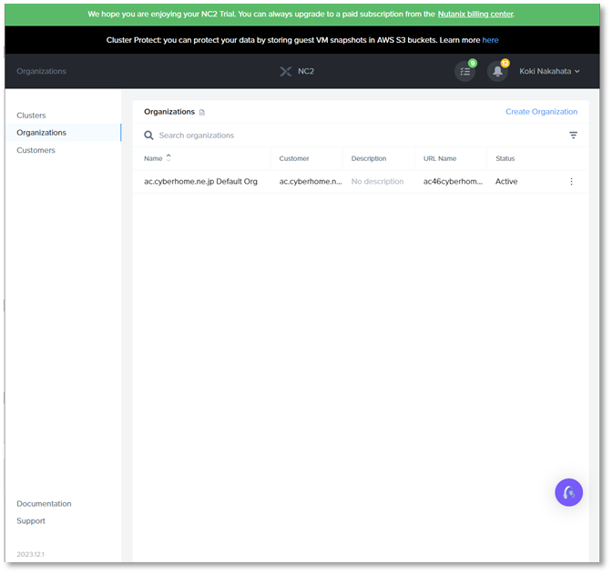

Click **Create Organization** and configure each item below.
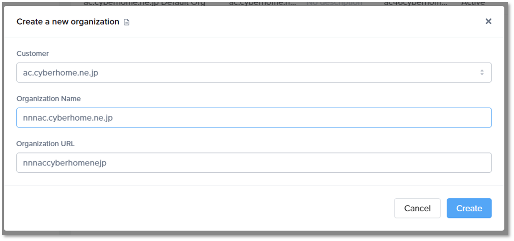

???note 
     Your organization URL will automatically be created.

From your organization`s menu, click **Cloud accounts** and then **Add Cloud Account**.
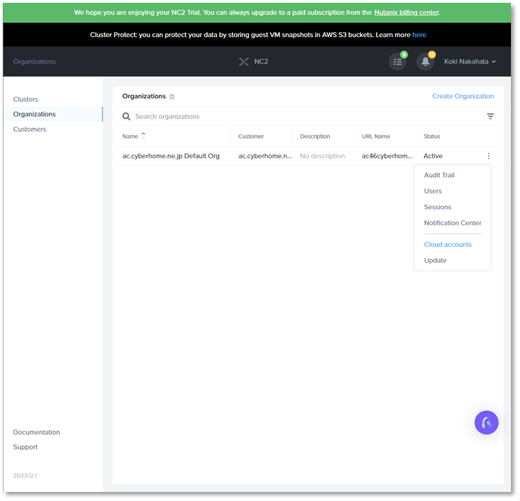
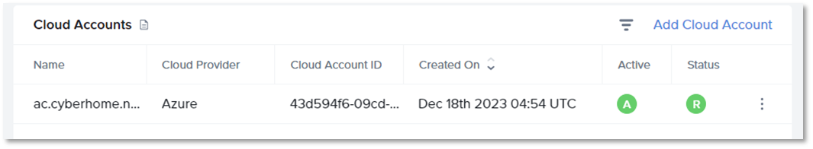

Enter required information found in your Azure portal.

- Direcotry ID: can be found in **Azure Active Directory**.
- Subscription ID: can be found in **Subscriptions**.
- Application ID: cane be found **App registrations**.
- Secret Value: is a value you saved in the last section.

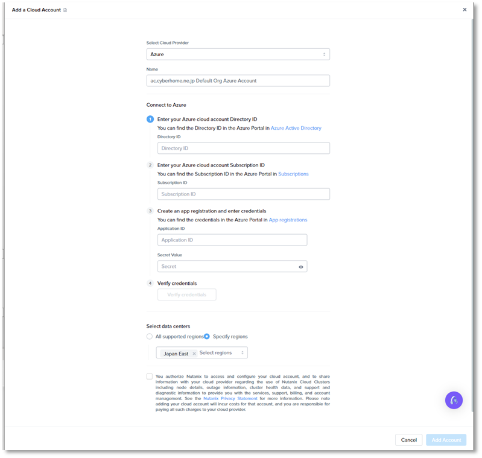

Verify your credentials, configure your regions and then click **Add Account**.

Next you will need to create your cluster.

In your NC2 console, navigate to **Clusters**>**Create Cluster**.
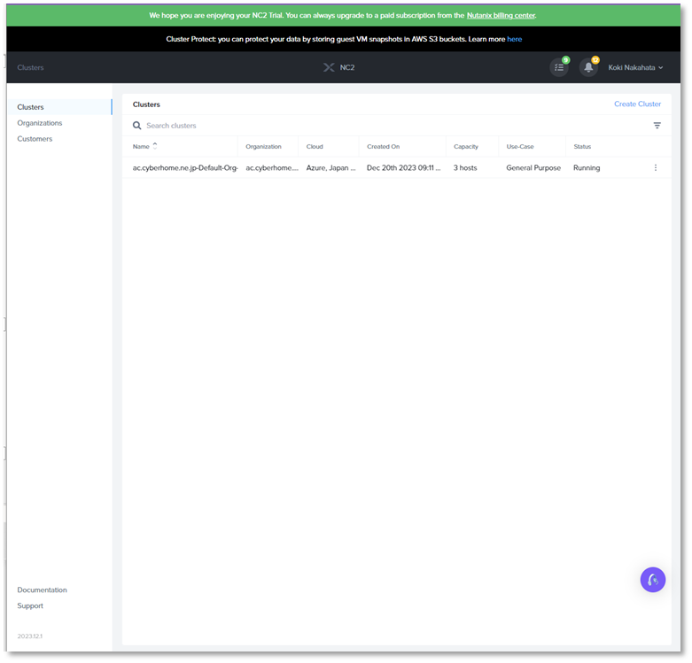

Choose either **General Purpose** or **Virtual Desktop Cluster** and **Next**. In this case, General Purpose has been selected.
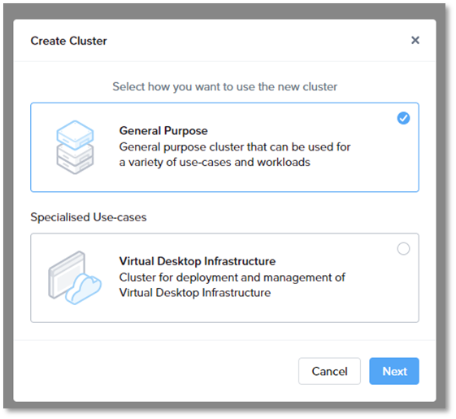

Select **Azure** at the Cloud Provider section and click **Next**.
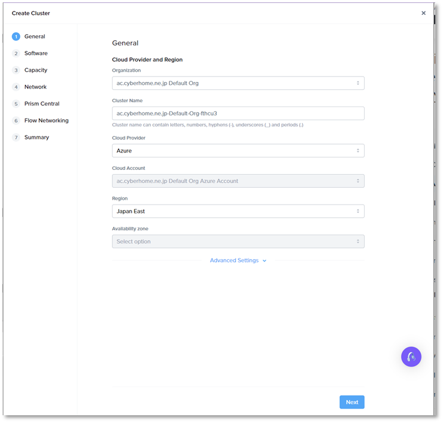

Configure **License Option**. In this case, AOS has been selected and choose **AOS version** and **Software Type**.
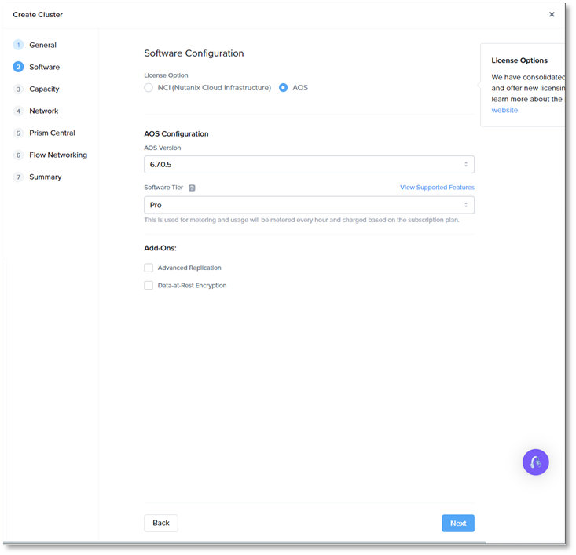
Click **Next**.

Configure **Capacity and Redundancy** as you prefer. In this case. 3 nodes and RF2 have been set.
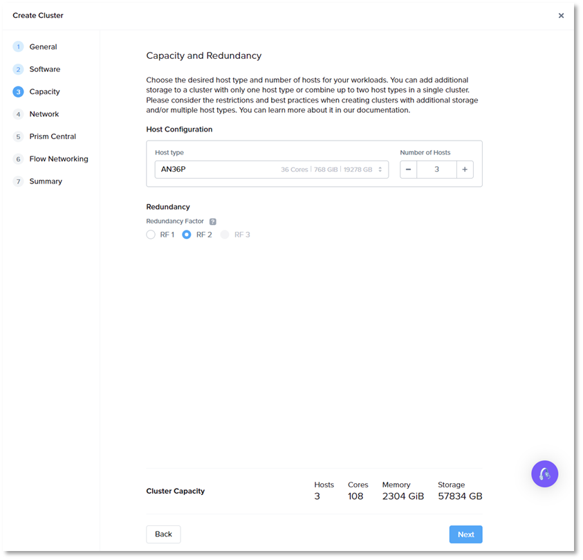

For Cluster Netork configuration, choose **Create a New VNet** and **Create New Resource Group**.
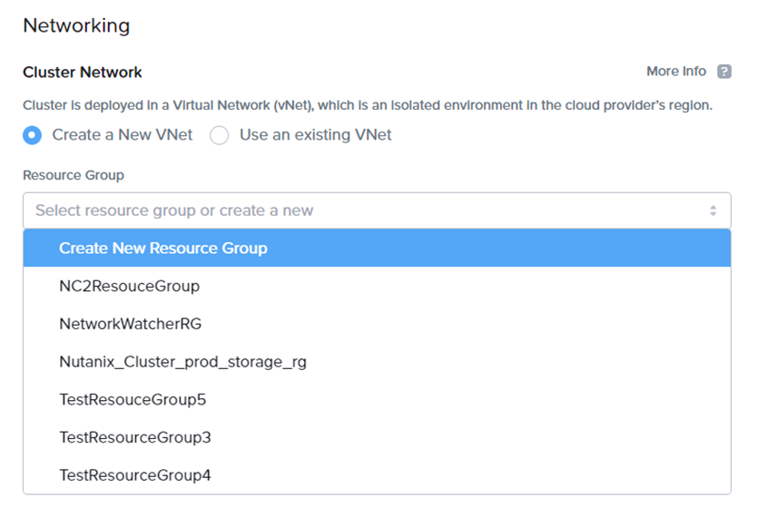

???Info
     For those who want to manualy prepare your Resource Group and VNet for NC2 and use them, refer to the document: [Manual Setup to Use Existing Azure Resources](https://portal.nutanix.com/page/documents/details?targetId=Nutanix-Cloud-Clusters-Azure:nc2-clusters-azure-manual-setup-to-use-existing-azure-resources-c.html).

Configure VNet CIDR between /16~22 and DNS servers as you prefer.
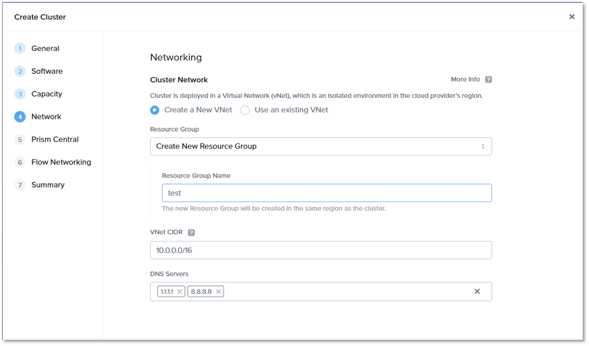

For Prism Central configuration, Prism Central Version should have automatically been set. Configure VNet CIDR between /16~22 as you prefer.
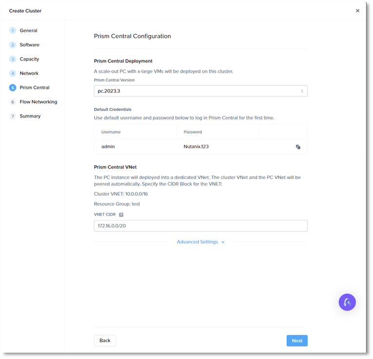

Create Key Pair for Flow Gateway VM.
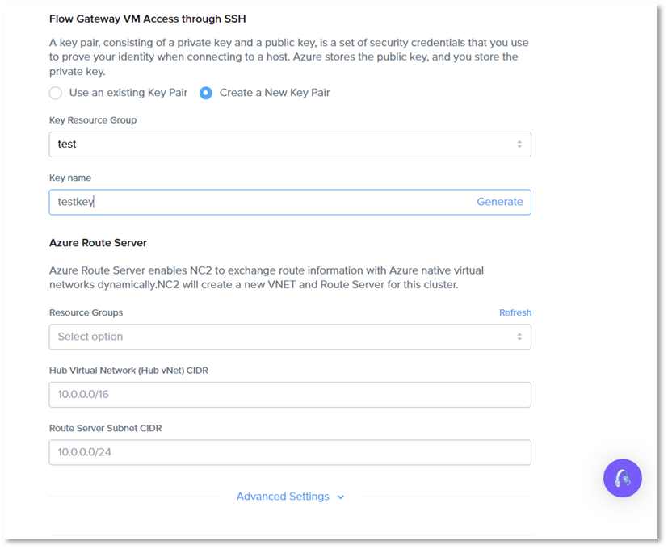

Configure Azure Route Server as your prefer and click **Next**.
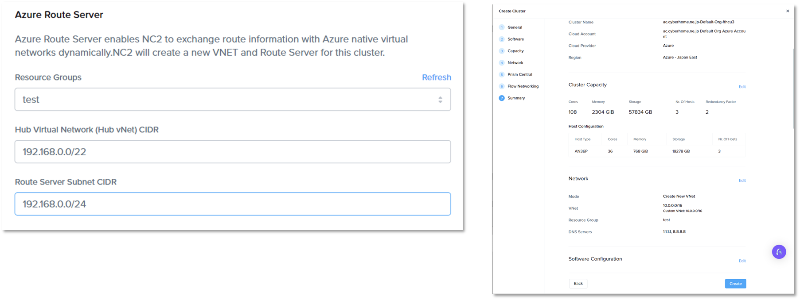

Review your configuration and click **Crete**.

Cluster deployment will start and should complete in 2~3 hours.
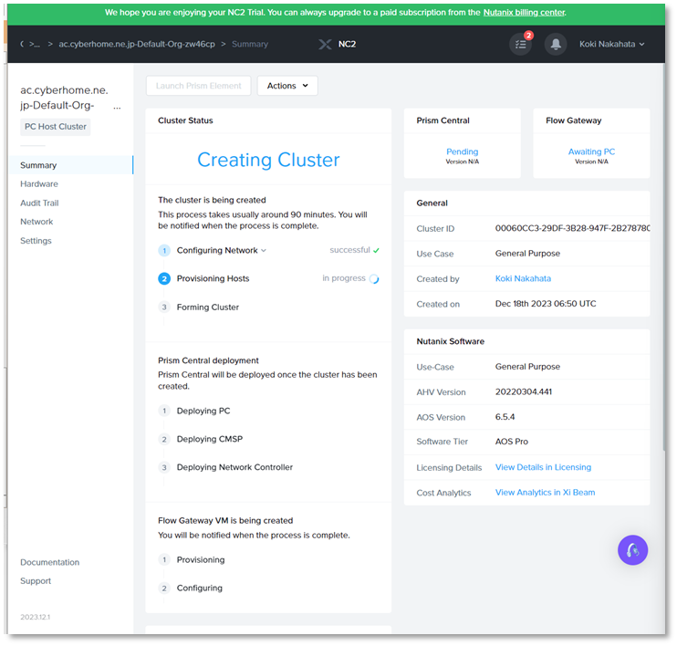 
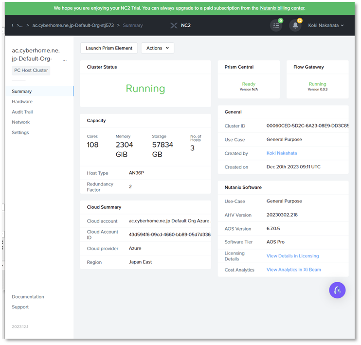