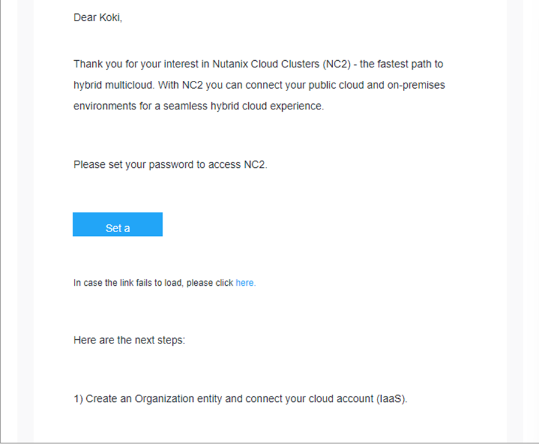
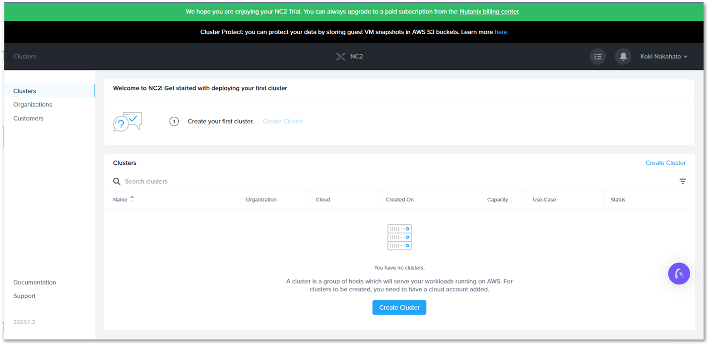

# Requesting Free Trial for NC2

You first request your free trial for NC2 here: [NC2 on Azure Free Trial](https://www.nutanix.com/products/nutanix-cloud-clusters/azure/free-trial)

Provide your email address and details.

???Info
       Nutanix domain and free email addresses (ex. iCloud or Gmail) are not allowed as email address. Use your provider/comapny address that you have.

!!!warning
          Nutanix domain and free email addresses (ex. iCloud or Gmail) are not allowed as email address. Use your provider/company address that you have.

Welcome email will be sent to your email box and set a password. 

Go to your **MyNutanix** portal, proceed to NC2 to launch and a NC2 console is visible.

!!!Info
       Free trial lasts 30 days only. 