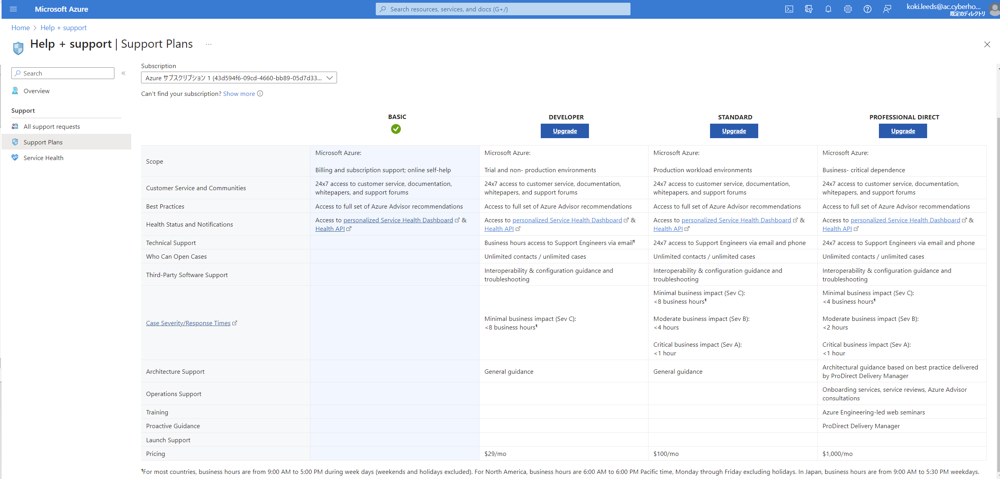
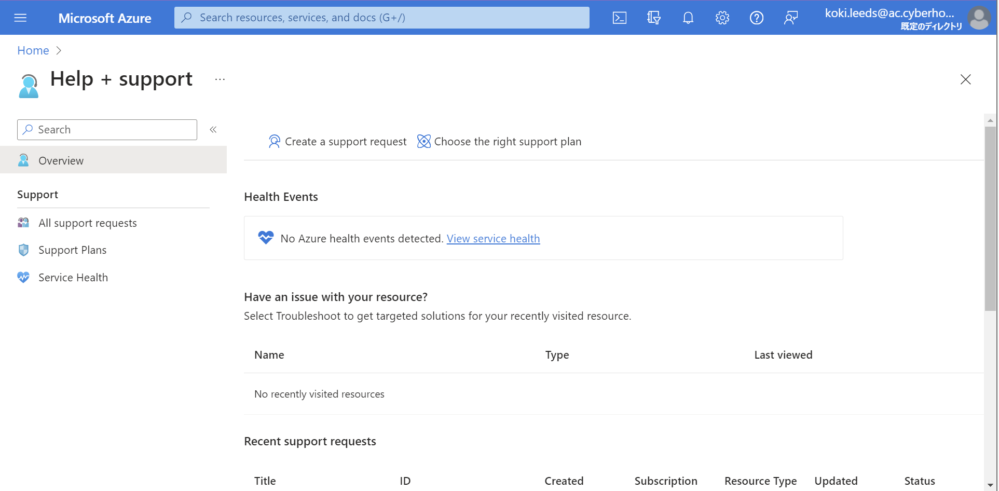
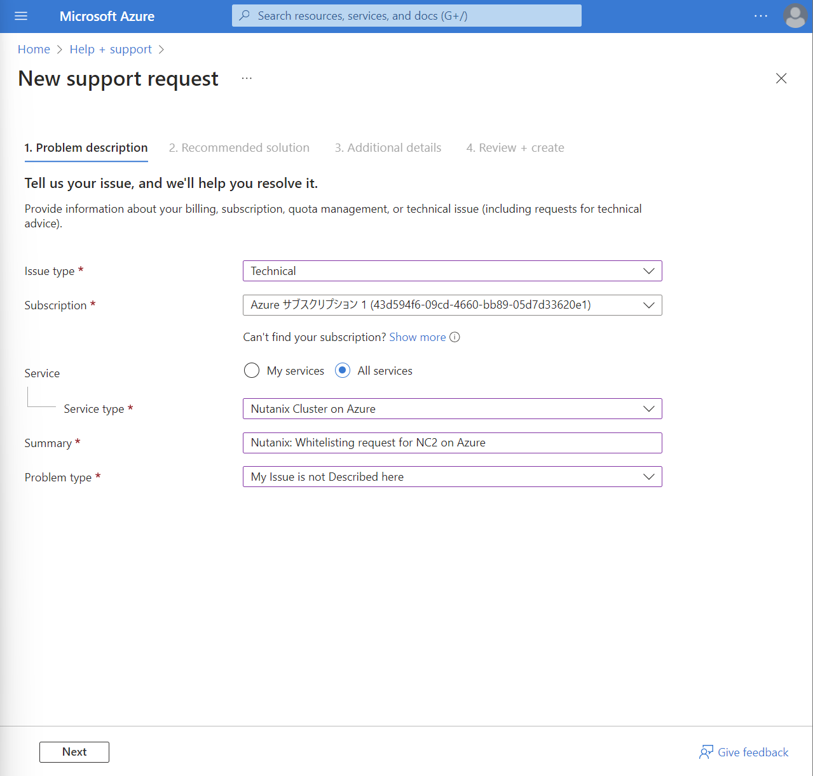
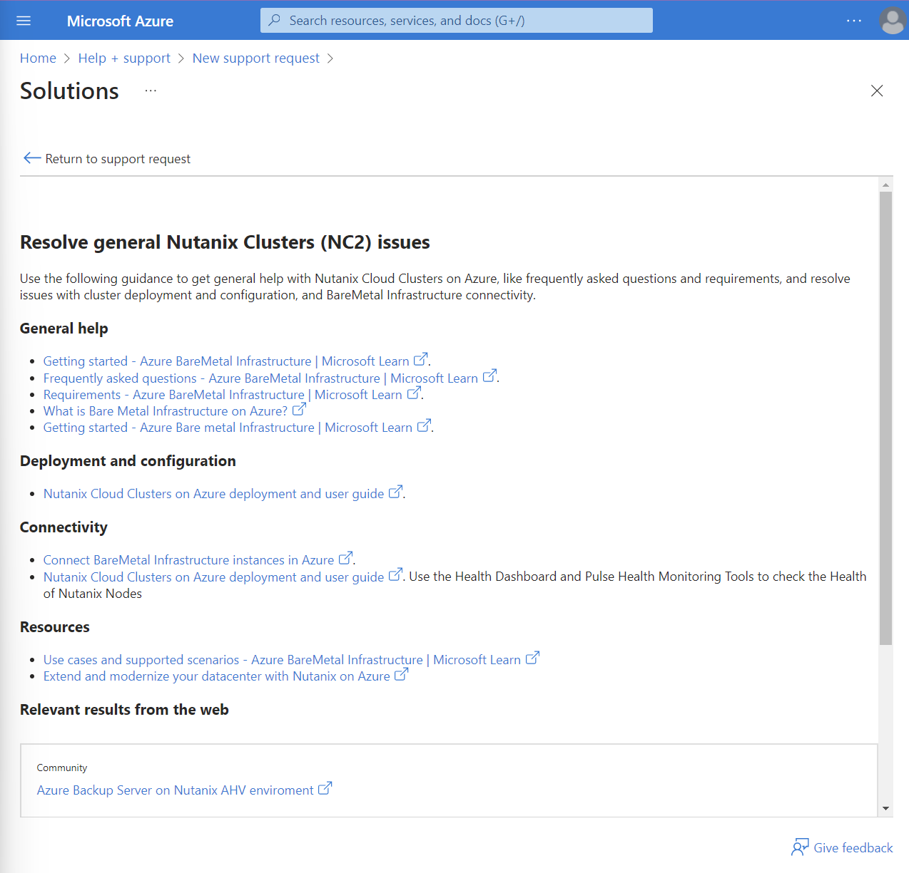
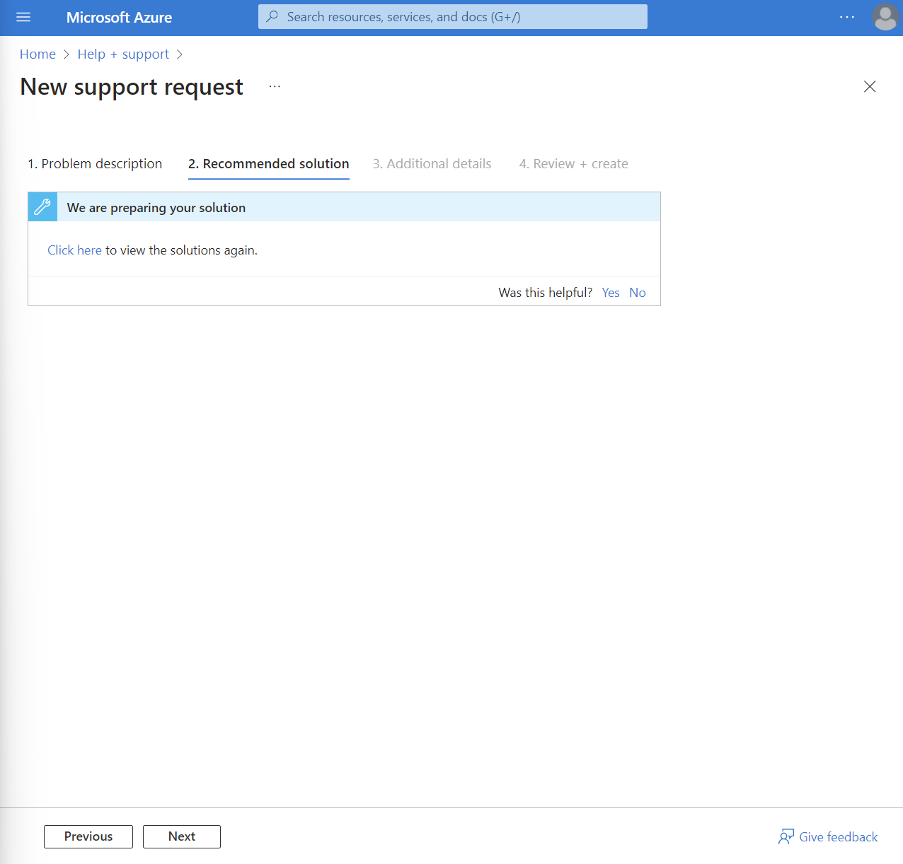

# Azure Whitelisting

To get started NC2 on Azure, you need to subscribe a paid plan. A DEVELOPER plan is the lowest cost so upgrade to this paid plan if your current plan is BASIC.

???Info
     Your Azure subscription must be whitelisted to start NC2 on Azure trial and only support engineers from Microsoft can handle this.

1. After upgrading your support plan, create a support request from the **Help + support** page. 

    

2. Provide information as shown below and click **Next**

    - Issue type: Technical
    - Subscription: default value (your Azure subscription)
    - Service: All services
    - Service type: Nutanix Cluster on Azure
    - Summary: <your company name>: Whitelisting request for NC2 on Azure
    - Problem type: My Issue is not Described here

    

3. Recommended solutions will be displayed but ignore these and **Click** Return to support request.

    

4. Click **Next** again.
   
    

5. Provide additional details as you prefer, proceed to **Review + create** and click **Create**.

Generally it will take 3 business days for the whitelisting process to complete. 

After your subscription has been allowlisted, you can proceed to the next section.